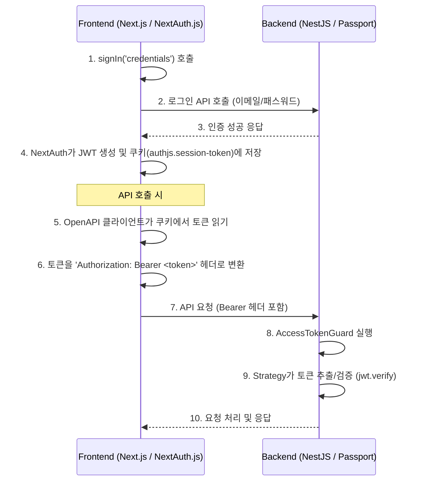

# 프로젝트 아키텍처 상세 문서

## 목차
* [1. 인증 및 보안 시스템](#1-인증-및-보안-시스템)
* [2. 데이터베이스 및 모델링](#2-데이터베이스-및-모델링)

---

## 1. 인증 및 보안 시스템

### 1.1. JWT 처리 흐름 (NextAuth.js 연동 기반)

본 프로젝트는 **NextAuth.js**를 인증 시스템으로 사용하며, 일반적인 REST API의 토큰 발급/갱신 방식과 다르게 **프론트엔드(NextAuth)가 주도하여 세션 토큰을 생성/관리**하는 특징을 가집니다.

* **토큰의 역할:** NextAuth.js가 생성한 JWT는 사용자 세션 정보를 담고 있으며, API 호출 시 Backend의 Passport 전략(`AccessTokenStrategy`)에 의해 사용자 인증에 사용됩니다.
* **Refresh Token 부재:** NextAuth.js의 세션 전략(`strategy: "jwt"`)을 사용했기 때문에, 세션 토큰의 만료가 임박하면 `SessionProvider`가 자동으로 세션 재확인 요청을 보내는 방식으로 로그인 상태를 유지합니다. **따라서 별도의 Refresh Token 필드는 사용하지 않습니다.**

### 1.2. JWT 처리 상세 프로세스

#### 1. Backend에서 JWT 처리하는 부분 (NestJS/Passport)

##### Step 1: JWT 전략 설정 (`AccessTokenStrategy`)

```typescript
// access-token.stragety.ts

@Injectable()
export class AccessTokenStrategy extends PassportStrategy(
  Strategy,
  'jwt-access-token',
) {
  constructor() {
    super({
      jwtFromRequest: ExtractJwt.fromAuthHeaderAsBearerToken(),
      ignoreExpiration: false,
      secretOrKey: process.env.AUTH_SECRET ?? '',
    });
  }

  validate(payload: JwtPayload) {
    return payload;
  }
}
```
- Bearer 토큰 방식으로 헤더에서 JWT 추출

- 만료 검증 활성화 (ignoreExpiration: false)

- 환경 변수로 시크릿 키 관리

- validate 메서드로 payload 검증 및 사용자 정보 반환

역할<br/>

- `ExtractJwt.fromAuthHeaderAsBearerToken()`: Authorization: Bearer <token> 헤더에서 토큰 추출
- `secretOrKey`: JWT 서명 검증용 시크릿 키
- `validate()`: 검증된 payload를 반환 (이후 req.user에 저장)


#####  Step 2: Guard 생성

```tsx
// access-token.guard.t

import { Injectable } from '@nestjs/common';
import { AuthGuard } from '@nestjs/passport';

@Injectable()
export class AccessTokenGuard extends AuthGuard('jwt-access-token') {}
```

- 데코레이터 기반으로 엔드포인트 보호
- @UseGuards(AccessTokenGuard)로 간단히 적용

<br/>
역할:<br/>

- `'jwt-access-token'` 전략을 사용하는 가드

##### Step 3: Controller에서 Guard 사용

```tsx
// app.controller.ts

 @Get('user-test')
  @UseGuards(AccessTokenGuard)
  @ApiBearerAuth('access-token')
  @ApiOperation({ summary: '로그인 유저 이메일' })
  @ApiOkResponse({
    description: '로그인 유저 이메일',
    type: String,
  })
  testUser(@Req() req: Request & { user: { email: string } }) {
    return `로그인 유저 이메일: ${req.user?.email}`;
  }
```

<br/>
**동작 흐름:**<br/>

1. 요청이 들어옴 → Authorization: Bearer <token> 헤더 포함<br/>
2. AccessTokenGuard가 AccessTokenStrategy 실행<br/>
3. Strategy가 토큰 추출 → 검증 → validate() 호출<br/>
4. 검증 성공 시 req.user에 payload 저장<br/>
5. Controller에서 req.user로 사용자 정보 접근<br/>


#### 2. Frontend에서 JWT 처리하는 부분 (NextAuth.js / OpenAPI Client)
##### Step 1: 로그인 및 NextAuth 설정 (JWT 생성)

```tsx
// frontend/app/(auth)/signin/ui.tsx
await signIn('credentials', {
  email,
  password,
  redirectTo: '/',
});

// frontend/auth.ts 설정 일부
session: {
  strategy: "jwt",
},
jwt: {
  encode: async ({ secret, token }) => {
    return jwt.sign(token as jwt.JwtPayload, secret as string);
  },
  // ... decode 함수
},
```

- signIn 후 NextAuth가 JWT를 생성하고 authjs.session-token 쿠키에 저장합니다.

##### Step 2: API 호출 시 Bearer 토큰 자동 추가
OpenAPI 클라이언트 초기화 시 쿠키에서 JWT를 읽어 Authorization: Bearer <token> 헤더로 변환하여 전송합니다.

```tsx
// frontend/config/openapi-runtime.ts (토큰 읽기)
export const createClientConfig: CreateClientConfig = config => ({
  // ...
  async auth() {
    return getCookie(AUTH_COOKIE_NAME, {cookies});
  },
});
```

#### 1.3. 전체 흐름 요약
이 구조는 NextAuth.js가 세션 토큰을 쿠키에 안전하게 관리하고, 자동 생성된 OpenAPI 클라이언트가 이를 Bearer 토큰으로 변환하여 백엔드에 전달하는 방식으로 통신합니다.
<details>
<summary>(요약) ⚡️ JWT 처리 전체 흐름 요약 보기</summary>

```typescript
[Frontend]
1. 사용자 로그인
   → signIn('credentials', {email, password})
   
2. NextAuth가 JWT 생성
   → jwt.sign()으로 토큰 생성
   → 쿠키에 저장 (authjs.session-token)
   
3. API 호출 시
   → getCookie()로 쿠키에서 토큰 읽기
   → OpenAPI 클라이언트가 자동으로 
     Authorization: Bearer <token> 헤더 추가
   
[Backend]
4. 요청 수신
   → AccessTokenGuard가 요청 가로채기
   
5. AccessTokenStrategy 실행
   → ExtractJwt.fromAuthHeaderAsBearerToken()로 
     Authorization 헤더에서 토큰 추출
   → jwt.verify()로 토큰 검증
   → validate()로 payload 반환
   
6. req.user에 사용자 정보 저장
   → Controller에서 req.user로 접근 가능
```
</details>
<br/>



* **핵심 포인트 1:** Frontend: NextAuth가 JWT 생성 → 쿠키 저장 → API 호출 시 자동으로 Bearer 헤더 추가
* **핵심 포인트 2:** Backend: Passport Strategy가 Bearer 토큰 추출 → 검증 → req.user에 저장

이 구조로 Frontend와 Backend가 JWT로 통신합니다.

## 2. 데이터베이스 및 모델링
// 여기에 데이터베이스 관련 상세 내용 작성

